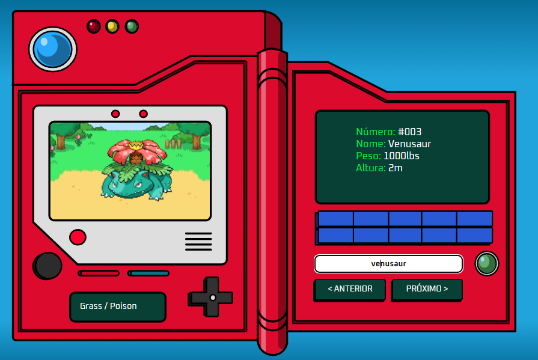
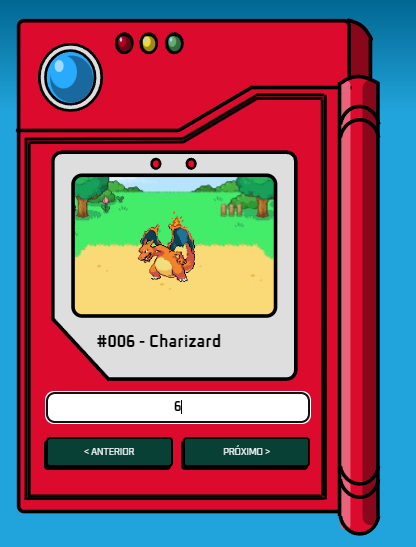
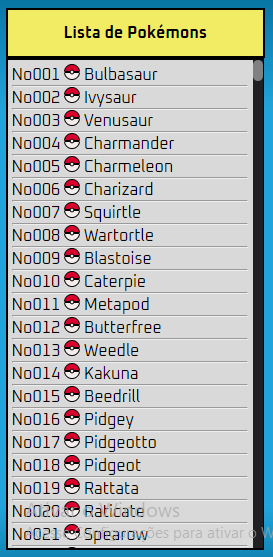

# Pokédex

A Pokédex é uma aplicação que traz dados sobre o Pokémon escolhido pelo usuário. Os pokémon presentes nela estão limitados até a quarta geração, ou seja, até o pokémon de número 493.

O projeto Pokédex foi desenvolvido com o objetivo de desenvolver as habilidades com o framework ReactJS e consumo de APIs.

[🔗 Clique aqui para acessar a página](https://nathanmarques2001.github.io/Pokedex/)

>## 🛠 Tecnologias
- HTML
- CSS
- JavaScript
- ReactJS
- PokéAPI
- ViteJS
- GIT e Github

># 📋 Processo  

### Design System  
Utilizando o [(Figma)](https://www.figma.com/), modelei página a página, os componentes e como estes devem se comportar em função da interação do usuário com os mesmos. 

### Pokédex Figma  
O intuito das pokédex modeladas no Figma era que elas tivessem espaçamento para inserir um campo input de texto e dois botões, além dos dados dos pokémon.
Equanto o modelo de desktop traz alguns dados, o modelo de Smartphone traz somente o número, nome e imagem do pokémon.

- Código
Após ter feito toda a pré-produção, baixei as imagens que seriam inseridas no projeto e codei.

> Como funciona a Pokédex?
O usuário insere um nome ou número do pokémon que deseja ver as informações, se o valor for válido o pokémon aparece no display com seus respectivos dados.

> Versão desktop

> Versão smartphone  

> Para auxiliar o usuário foi inserido uma lista de pokémons, com seus números e nomes.  

> De onde saem os dados?
Os dados são buscados na API [!(PokéAPI)](https://pokeapi.co/), utilizando o fetch do JavaScript.

> Outras páginas
Também estão inclusas na aplicação uma página "Sobre", que traz algumas informações sobre o projeto. E, uma página "Contato", que têm alguns links para entrar em contato comigo!

>## ✉️ Contato

### nathanbrandao1@gmail.com
